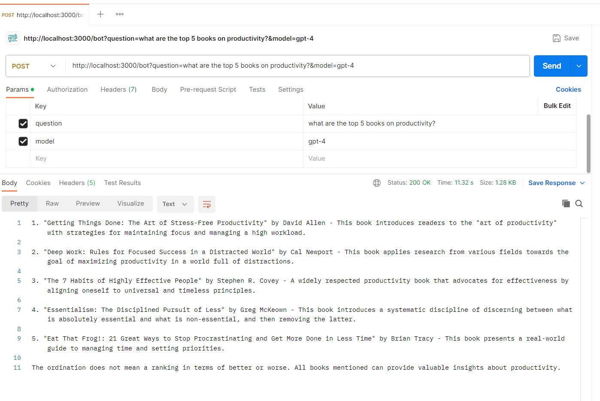

#### My own chatGPT microservice with RESTful API

- It is my own chatgpt microservice, developed using nodejs.

Use different LLM models for model inputs such as

- gpt-4
- gpt-3.5-turbo
- etc

Find more
<a href="https://platform.openai.com/docs/models/gpt-3-5">OpenAI LLM models</a> on this url

